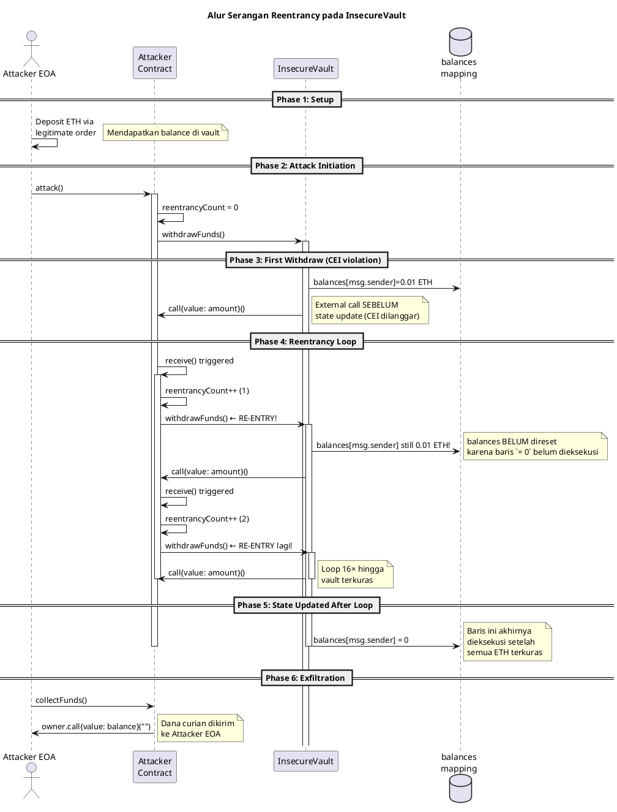

# Lampiran 15. Source Code Diagram (PlantUML dan Mermaid)

> **Cross-reference:** Mendukung reproduksibilitas **Gambar 2 (State machine siklus escrow rantai pasok)** dan **Gambar 8 (Sequence diagram serangan reentrancy pada InsecureVault)**.
>
> **Repositori:**
> - [`analysis/sequence_diagram.puml`](https://github.com/nurcahyapriantoro/skripsi-final/blob/main/analysis/sequence_diagram.puml) — PlantUML untuk sequence diagram
> - [`analysis/activity_diagram.md`](https://github.com/nurcahyapriantoro/skripsi-final/blob/main/analysis/activity_diagram.md) — Mermaid untuk state machine escrow
>
> Lampiran ini memuat source code diagram agar reviewer dapat mereproduksi atau memodifikasi visualisasi tanpa harus menggambar ulang dari narasi skripsi.

---

## 15.1 Sequence Diagram Serangan Reentrancy (Gambar 8) — PlantUML

**File sumber:** [`analysis/sequence_diagram.puml`](https://github.com/nurcahyapriantoro/skripsi-final/blob/main/analysis/sequence_diagram.puml)
**Raw:** https://raw.githubusercontent.com/nurcahyapriantoro/skripsi-final/main/analysis/sequence_diagram.puml
**Render engine:** [PlantUML](https://plantuml.com/) — dapat dirender via VS Code extension, IntelliJ plugin, atau CLI (`plantuml sequence_diagram.puml`).



**Penjelasan blok:**
- **Phase 1 (Setup):** Attacker menyetor 0,1 ETH secara sah.
- **Phase 2 (Initiation):** EOA memicu `attack()`. Attacker memanggil `withdrawFunds()` pertama.
- **Phase 3 (First Withdraw):** InsecureVault membaca saldo (0,1 ETH), lalu **MENTRANSFER ETH sebelum menulis `balances = 0`**. Inilah pelanggaran CEI.
- **Phase 4 (Reentrancy Loop):** `call` eksternal memicu `receive()` di Attacker, yang langsung memanggil `withdrawFunds()` lagi. Karena `balances[attacker]` masih 0,1 ETH (belum di-nol-kan), iterasi berulang.
- **Phase 5 (State Updated):** Baris `balances[msg.sender] = 0` akhirnya dieksekusi — tapi setelah ETH habis.
- **Phase 6 (Exfiltration):** EOA memanggil `collectFunds()` untuk mengirim ETH curian ke wallet Attacker.

**Catatan PlantUML:**
- `activate`/`deactivate` menampilkan frame aktivasi subroutine.
- `note right` untuk anotasi penjelasan.
- `database` digunakan untuk visualisasi storage `balances` (mapping).

---

## 15.2 Activity Diagram Siklus Escrow (Gambar 2) — Mermaid

**File sumber:** [`analysis/activity_diagram.md`](https://github.com/nurcahyapriantoro/skripsi-final/blob/main/analysis/activity_diagram.md)
**Raw:** https://raw.githubusercontent.com/nurcahyapriantoro/skripsi-final/main/analysis/activity_diagram.md
**Render engine:** [Mermaid](https://mermaid.js.org/) — built-in di GitHub Markdown, GitLab, VS Code, dan banyak platform lain.

````markdown
```mermaid
flowchart TD
    subgraph "InsecureVault (Rentan)"
        A1[withdrawFunds dipanggil] --> A2[amount = balances[msg.sender]]
        A2 --> A3{amount > 0?}
        A3 -->|No| A4[Revert]
        A3 -->|Yes| A5[msg.sender.call{value: amount}]
        A5 --> A6[balances[msg.sender] = 0]
        A6 --> A7[Dana terkirim ✅]
        style A5 fill:#ffcccc,stroke:#ff0000
        linkStyle 3 stroke:#ff0000,stroke-width:2px
    end

    subgraph "SecureVault / MutexVault (Termitigasi - CEI)"
        B1[withdrawFunds dipanggil] --> B2[amount = balances[msg.sender]]
        B2 --> B3{amount > 0?}
        B3 -->|No| B4[Revert]
        B3 -->|Yes| B5[balances[msg.sender] = 0]
        B5 --> B6[msg.sender.call{value: amount}]
        B6 --> B7[Dana terkirim ✅]
        style B5 fill:#ccffcc,stroke:#00cc00
        linkStyle 8 stroke:#00cc00,stroke-width:2px
    end
```
````

**Penjelasan blok:**
- **Subgraph "InsecureVault (Rentan)":** Aliran `[CHECKS] → [INTERACTIONS] → [EFFECTS]`. Panah merah menandai `msg.sender.call{}` yang dieksekusi **sebelum** `balances[msg.sender] = 0`.
- **Subgraph "SecureVault / MutexVault (CEI)":** Aliran `[CHECKS] → [EFFECTS] → [INTERACTIONS]`. Panah hijau menandai `balances[msg.sender] = 0` yang dieksekusi **sebelum** `msg.sender.call{}`.
- **Visual style:**
  - `style A5 fill:#ffcccc,stroke:#ff0000` — node merah untuk eksternal call yang rentan.
  - `style B5 fill:#ccffcc,stroke:#00cc00` — node hijau untuk update state yang aman.
  - `linkStyle 3 stroke:#ff0000,stroke-width:2px` — panah merah dari A4 ke A5.
  - `linkStyle 8 stroke:#00cc00,stroke-width:2px` — panah hijau dari B4 ke B5.

---

## 15.3 Panduan Reproduksi

### Opsi A: VS Code + PlantUML extension
1. Install extension "PlantUML" (oleh jebbs) di VS Code.
2. Buka `sequence_diagram.puml` → preview otomatis muncul di panel kanan.

### Opsi B: Mermaid di Markdown
1. Buka `activity_diagram.md` di GitHub/GitLab/VS Code dengan Mermaid preview.
2. Diagram langsung ter-render di blok kode ```mermaid`.

### Opsi C: CLI
```bash
# PlantUML CLI
plantuml analysis/sequence_diagram.puml
# Output: sequence_diagram.png

# Mermaid CLI
npm install -g @mermaid-js/mermaid-cli
mmdc -i analysis/activity_diagram.md -o activity_diagram.png
```

— **Akhir Lampiran 15** —
