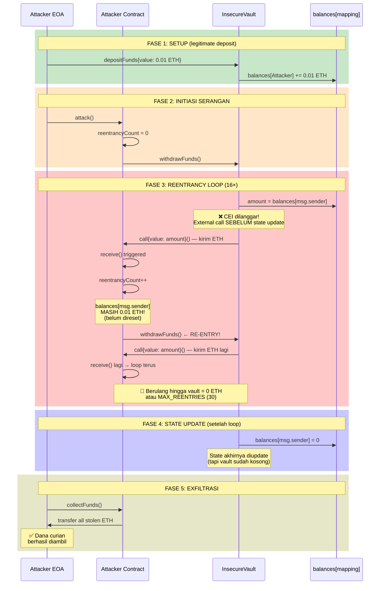

<b>📊 Sequence Diagram — Alur Serangan Reentrancy</b>

```mermaid
sequenceDiagram
    participant EOA as Attacker EOA
    participant ATK as Attacker Contract
    participant VAULT as InsecureVault
    participant STATE as balances[mapping]

    rect rgb(200, 230, 200)
        Note over EOA,STATE: FASE 1: SETUP (legitimate deposit)
        EOA->>VAULT: depositFunds{value: 0.01 ETH}
        VAULT->>STATE: balances[Attacker] += 0.01 ETH
    end

    rect rgb(255, 230, 200)
        Note over EOA,STATE: FASE 2: INITIASI SERANGAN
        EOA->>ATK: attack()
        ATK->>ATK: reentrancyCount = 0
        ATK->>VAULT: withdrawFunds()
    end

    rect rgb(255, 200, 200)
        Note over EOA,STATE: FASE 3: REENTRANCY LOOP (16×)
        VAULT->>STATE: amount = balances[msg.sender]
        Note over VAULT: ❌ CEI dilanggar!<br/>External call SEBELUM state update
        VAULT->>ATK: call{value: amount}() — kirim ETH
        ATK->>ATK: receive() triggered
        ATK->>ATK: reentrancyCount++
        Note over ATK: balances[msg.sender]<br/>MASIH 0.01 ETH!<br/>(belum direset)
        ATK->>VAULT: withdrawFunds() ← RE-ENTRY!
        VAULT->>ATK: call{value: amount}() — kirim ETH lagi
        ATK->>ATK: receive() lagi → loop terus
        Note over VAULT,ATK: 🔄 Berulang hingga vault = 0 ETH<br/>atau MAX_REENTRIES (30)
    end

    rect rgb(200, 200, 255)
        Note over EOA,STATE: FASE 4: STATE UPDATE (setelah loop)
        VAULT->>STATE: balances[msg.sender] = 0
        Note over VAULT: State akhirnya diupdate<br/>(tapi vault sudah kosong)
    end

    rect rgb(230, 230, 200)
        Note over EOA,STATE: FASE 5: EXFILTRASI
        EOA->>ATK: collectFunds()
        ATK->>EOA: transfer all stolen ETH
        Note over EOA: ✅ Dana curian<br/>berhasil diambil
    end
```

