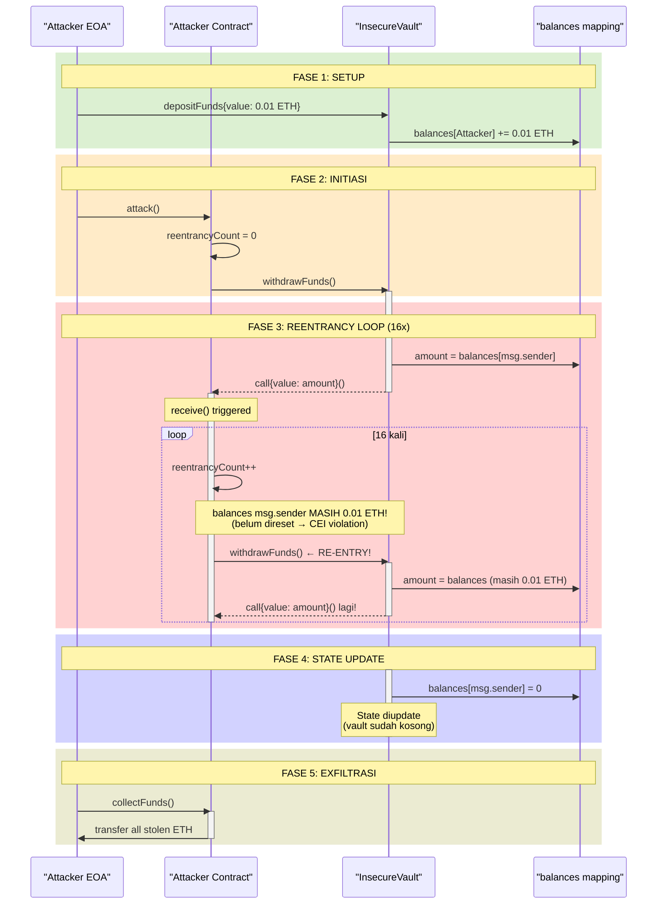

```mermaid
sequenceDiagram
    participant EOA as "Attacker EOA"
    participant ATK as "Attacker Contract"
    participant VAULT as "InsecureVault"
    participant STATE as "balances mapping"

    rect rgb(220, 240, 210)
        Note over EOA,STATE: FASE 1: SETUP
        EOA->>VAULT: depositFunds{value: 0.01 ETH}
        VAULT->>STATE: balances[Attacker] += 0.01 ETH
    end

    rect rgb(255, 235, 200)
        Note over EOA,STATE: FASE 2: INITIASI
        EOA->>ATK: attack()
        ATK->>ATK: reentrancyCount = 0
        ATK->>VAULT: withdrawFunds()
        activate VAULT
    end

    rect rgb(255, 210, 210)
        Note over EOA,STATE: FASE 3: REENTRANCY LOOP (16x)
        VAULT->>STATE: amount = balances[msg.sender]
        VAULT-->>ATK: call{value: amount}()
        deactivate VAULT
        activate ATK
        Note over ATK: receive() triggered
        
        loop 16 kali
            ATK->>ATK: reentrancyCount++
            Note over ATK,VAULT: balances msg.sender MASIH 0.01 ETH!<br/>(belum direset → CEI violation)
            ATK->>VAULT: withdrawFunds() ← RE-ENTRY!
            activate VAULT
            VAULT->>STATE: amount = balances (masih 0.01 ETH)
            VAULT-->>ATK: call{value: amount}() lagi!
            deactivate VAULT
        end
        
        deactivate ATK
    end

    rect rgb(210, 210, 255)
        Note over EOA,STATE: FASE 4: STATE UPDATE
        activate VAULT
        VAULT->>STATE: balances[msg.sender] = 0
        Note over VAULT: State diupdate<br/>(vault sudah kosong)
        deactivate VAULT
    end

    rect rgb(235, 235, 210)
        Note over EOA,STATE: FASE 5: EXFILTRASI
        EOA->>ATK: collectFunds()
        activate ATK
        ATK->>EOA: transfer all stolen ETH
        deactivate ATK
    end
```
